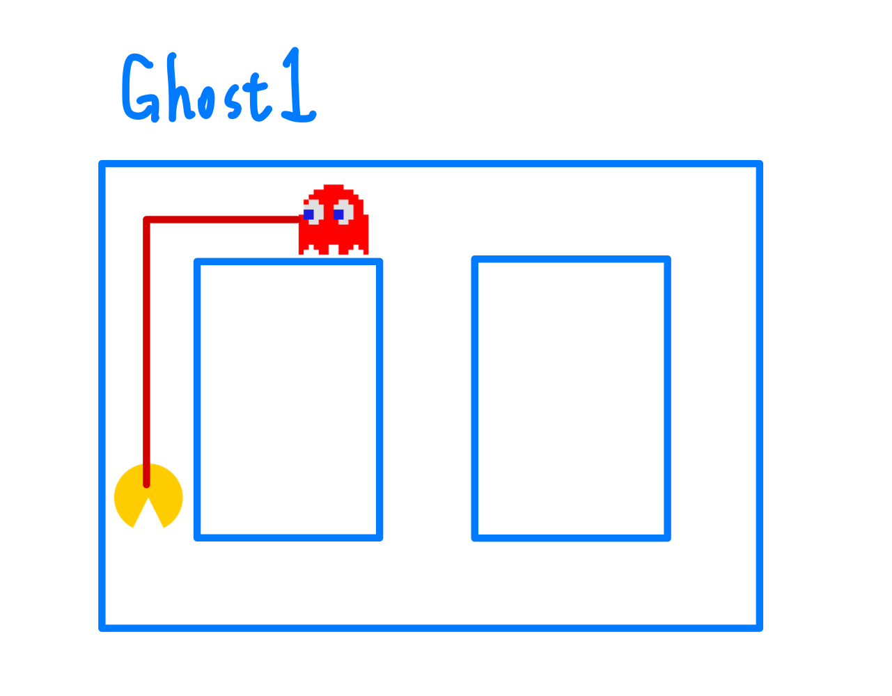
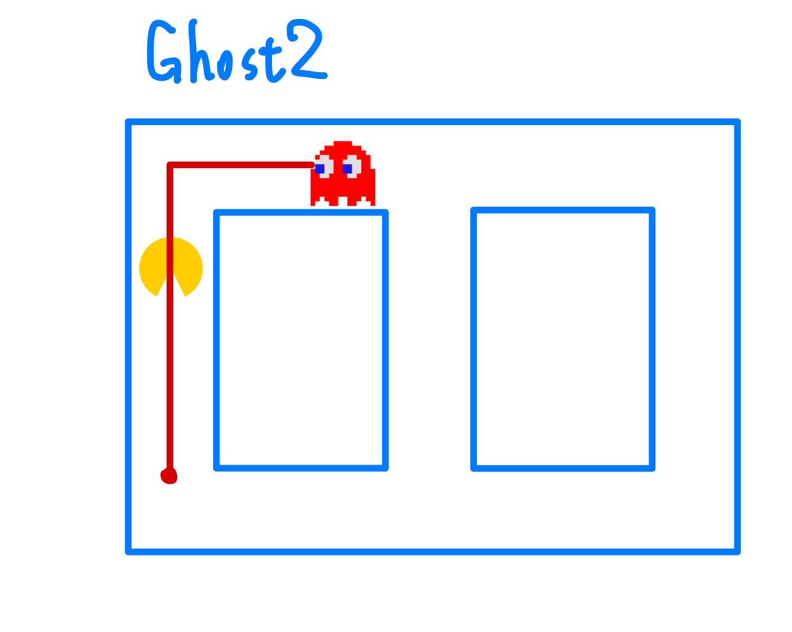
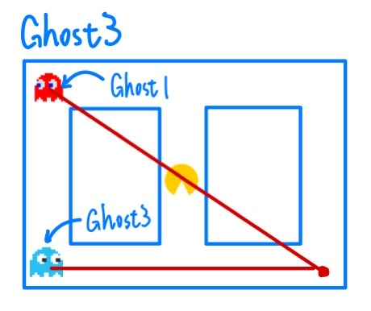
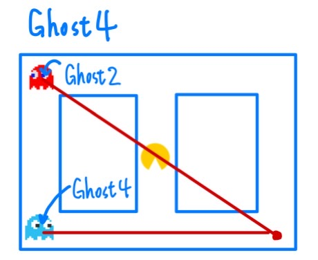
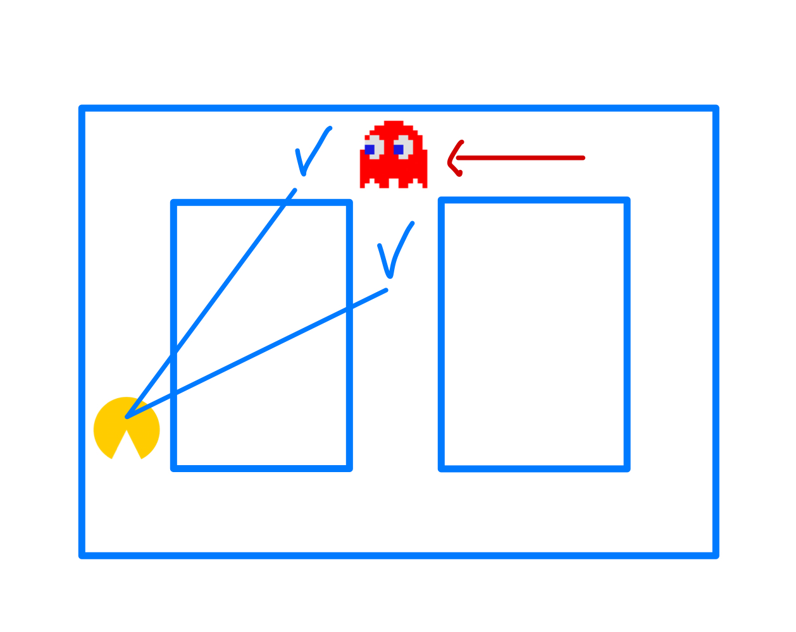

# Pacman-x86-assembly

course:微算機概論實習 陸敬互教授

## Game rule

## Code feature
#### Ghost how to chased the pacman
In our game we have four ghost, each ghost have it's unique algorithm. Below is the brief introduction.

#### Ghost1 algorithm  
Ghost1 will find the shortest route to chased to Pacman.
<p align="center"></p>


#### Ghost2 algorithm  
Ghost2 will chased 8 space infront of the Pacman.
<p align="center"></p>


#### Ghost3 algorithm  
Ghost3 will chased the position which can let Pacman be the middle of the Ghost1 and Ghost3
<p align="center"></p>

#### Ghost4 algorithm  
Ghost4 will chased the position which can let Pacman be the middle of the Ghost2 and Ghost4
<p align="center"></p>

## How to find the best direction
>[!NOTE]
>Due to assembly is difficult to accomplish recursive. So we use other method to find the direction. Althought the result may not be the best solution. But this is the most easy way to find out the direction.
### Basic principle
<p align="center"></p>

1. First will compare wheather the Ghost is on the intersection.
2. Compare which direction it doesn't have wall infront. And it can't walk backward.
3. Compute which direction it can get the shortest distance.
>[!NOTE]
>You can find out all intersection on the map and label as a different number in previous. This can reduce CPU usage.

### Other algorithm make Ghost more smarter
Because breifly using Ghost2, Ghost3, Ghost4 mode we find out the Ghost may pass the Pacman in a near distance. It's really stupid. So ghost and Pacman smaller than a certain value the Ghost will use Ghost1 mode to chase the Pacman.

But just pursuit can lead to a situation where all ghosts are very close behind the Pacman, making it impossible to catch the Pacman. Moreover, because they are so close to the Pacman, the calculated direction remains the same. This allows for continuous circling to score points easily. 

Therefore, we added a condition: if the pursuit algorithm is executed more than a certain number of times, the ghost will reverse direction to prevent a situation where the ghosts and the Pacman form a straight line. Additionally, as time progresses, the ghosts will move faster.

Because Ghost2, Ghost3, Ghost4 mode is familiar. So below is Ghost2 algorithm.
### Ghost2 main code
```
matrix_return Ghost2_X, Ghost2_Y
cmp AX, 7 ;Compare whether is on the intersection
je Ghost2_pivotal_point
jne Ghost2_pivotal_point_PASS
Ghost2_pivotal_point: 
    ;if chased mode excute more than certain time goes reverse
    .if Ghost2_near_time > 10 && Ghost2_dir == 0 
        Mov Ghost2_dir, 2
        Mov Ghost2_near_time, 0
        JMP Ghost2_pivotal_point_PASS
    .elseif Ghost2_near_time > 10 && Ghost2_dir == 1
        Mov Ghost2_dir, 3
        Mov Ghost2_near_time, 0
        JMP Ghost2_pivotal_point_PASS
    .elseif Ghost2_near_time > 10 && Ghost2_dir == 2
        Mov Ghost2_dir, 0
        Mov Ghost2_near_time, 0
        JMP Ghost2_pivotal_point_PASS
    .elseif Ghost2_near_time > 10 && Ghost2_dir == 3
        Mov Ghost2_dir, 1
        Mov Ghost2_near_time, 0
        JMP Ghost2_pivotal_point_PASS
    .endif
    ;compute Ghost and Pacman distance
    Push5_parameter Pacman_X, Pacman_Y, Ghost2_X, Ghost2_Y, 10
    call Distance
    cmp AX, Ghost_max
    jae Ghost2_far
    jb Ghost2_near
    Ghost2_near:
        ;use Ghost1 mode
        INC Ghost2_near_time
        Ghost1_to_Direction Ghost2_X, Ghost2_Y, Ghost2_dir, Pacman_X, Pacman_Y
        call Ghost_move
        Mov Ghost2_dir, AX
        JMP Ghost2_pivotal_point_PASS
    Ghost2_far:  
    ;predict Pacman 8 space infront
    Mov Ghost2_near_time, 0
    Ghost2_to_Direction 
    call Ghost_move ;return Direction
    Mov Ghost2_dir, AX
Ghost2_pivotal_point_PASS:
Ghost2_Position_change ;Change Ghost2 direction
```
### Compute offset address
```
Ghost2_to_Direction macro
    local dir_0, dir_0_PASS, dir_1, dir_1_PASS, dir_2, dir_2_PASS, dir_3, dir_3_PASS
    Mov AX, Ghost2_X
    Mov GX, AX
    Mov AX, Ghost2_Y
    Mov GY, AX
    Mov AX, Ghost2_dir
    Mov G_dir, AX
    Mov Direction_usable[0], 0
    Mov Direction_usable[1], 0
    Mov Direction_usable[2], 0
    Mov Direction_usable[3], 0
    Mov AX, Pacman_Dir
    cmp AX, 0;if Pacman diection faced up
    je dir_0
    jne dir_0_PASS
    dir_0:
        Mov AX, Pacman_X
        SUB AX, 8
        Mov PX, AX
        Mov AX, Pacman_Y
        Mov PY, AX
    dir_0_PASS:
    cmp AX, 1;if Pacman diection faced right
    je dir_1
    jne dir_1_PASS
    dir_1:
        Mov AX, Pacman_Y
        ADD AX, 8
        Mov PY, AX
        Mov AX, Pacman_X
        Mov PX, AX
    dir_1_PASS:
    cmp AX, 2;if Pacman diection faced down
    je dir_2
    jne dir_2_PASS
    dir_2:
        Mov AX, Pacman_X
        ADD AX, 8
        Mov PX, AX
        Mov AX, Pacman_Y
        Mov PY, AX
    dir_2_PASS:
    cmp AX, 3;if Pacman diection faced left
    je dir_3
    jne dir_3_PASS
    dir_3:
        Mov AX, Pacman_Y
        SUB AX, 8
        Mov PY, AX
        Mov AX, Pacman_X
        Mov PX, AX
    dir_3_PASS:
endm
```
### Compute the best direction
```
Ghost_move proc
    local nShortest:WORD, pointer:WORD, pointer_distance:WORD;, nDistance:WORD
    Mov nShortest, 0
    Mov pointer_distance, 0
    Mov pointer, 0
    Mov AX, G_dir
    Mov pointer, AX
Compare_Whether_Same_PASS:
    matrix_space GX, GY, -1, 0;return matrix[GX-1][GY] value
    cmp AX, 0 ;compare whether there is space
    je UP_have_Space
    jne UP_have_Space_PASS
UP_have_Space:
    Mov Direction_usable[0], 1 ;mark this direction as usable
UP_have_Space_PASS:

    matrix_space GX, GY, 0, 1;return matrix[GX][GY+1] value
    cmp AX, 0 ;compare whether there is space
    je RIGHT_have_Space
    jne RIGHT_have_Space_PASS
RIGHT_have_Space:
    Mov Direction_usable[1], 1 ;mark this direction as usable
RIGHT_have_Space_PASS:

    matrix_space GX, GY, 1, 0;return matrix[GX+1][GY] value
    cmp AX, 0 ;compare whether there is space
    je DOWN_have_Space
    jne DOWN_have_Space_PASS
DOWN_have_Space:
    Mov Direction_usable[2], 1 ;mark this direction as usable
DOWN_have_Space_PASS:

    matrix_space GX, GY, 0, -1;return matrix[GX][GY-1] value
    cmp AX, 0 ;compare whether there is space
    je LEFT_have_Space
    jne LEFT_have_Space_PASS
LEFT_have_Space:
    Mov Direction_usable[3], 1 ;mark this direction as usable
LEFT_have_Space_PASS:
    Mov BX, pointer ;don't go reverse direction
    ADD BX, 2 
    cmp BX, 3
    ja pointer_too_big
    jbe pointer_not_too_big
pointer_too_big:
    SUB BX, 4
pointer_not_too_big:
    Mov Direction_usable[BX], 0
    Mov AX, 0
    Mov CX, 0
Loop_compare_shortest_distance:;Compute the best direction
        Mov BX, CX
        cmp Direction_usable[BX], 1
        je if_direction_usable
        jne if_direction_not_usable
    if_direction_usable:
        Mov pointer_distance, CX
        push GX
        push GY
        Push5_parameter PX, PY, GX, GY, pointer_distance
        call Distance;Return Ghost and Pacman distance
        pop GY
        pop GX
        
        Mov BX, nShortest;if(nShortest == 0)
        cmp BX, 0
        je First_Distance
        jne Not_First_Distance
        First_Distance:
            Mov nShortest, AX
            Mov pointer, CX
        Not_First_Distance:
        cmp nShortest, AX;if(nDistance < nShorest)
        jae nShortest_change
        jb if_direction_not_usable
        nShortest_change:
            Mov nShortest, AX
            Mov pointer, CX
    if_direction_not_usable:
        INC CX 
        CMP CX, 4
        jne Loop_compare_shortest_distance
    Mov AX, pointer
    ret
Ghost_move endp
```
### File Read
We can find out whether there is any file exist. If there isn't any file exist. We will create one and show the basic rule of the game.
```
checkscore macro
    local check_ascii1,check_ascii2,check_ascii3
    push ax
    openfile ;Open file
    readfile ;Read file
    pop ax
    mov ax,0
    add al,file_score[2] ;Storage digit
    cmp al,96 ;Compare whether is A~F
    jna check_ascii1
    sub al,39
    check_ascii1:
    sub al,30h
    mov bl,file_score[1] ;Storage ten digit
    cmp bl,96 ;Compare whether is A~F
    jna check_ascii2
    sub bl,39
    check_ascii2:
    sub bl,30h
    shl bl,4
    add al,bl
    mov bl,file_score[0] ;Storage hundred digit
    cmp bl,96 ;Compare whether is A~F
    jna check_ascii3
    sub bl,39
    check_ascii3:
    sub bl,30h
    add ah,bl
    mov highest_score,ax ;Mov highestsocre to highest_score valable
    pusha
    closefile
    popa
endm
```
### Play Music
Because if only simple images are displayed, it might feel a bit dull, so we added a sound component. When the sprite is caught by a ghost, it will emit a sound to alert the player that they have died. Similarly, at the end of the game, there will be a reminder that the game has concluded. Due to constraints in the program segment, it wasn't possible to compose a full song, so it will only play a simple tune like Mi-Re-Do.

Music frequency [here](http://muruganad.com/8086/8086-assembly-language-program-to-play-sound-using-pc-speaker.html)
```
play_sound  macro
    local pause1, pause2
    mov     al, 182  ;Enable Timer
    out     43h, al        
    mov     ax, 4530 ;Set frequency  
    out     42h, al        
    mov     al, ah    
    out     42h, al 
    in      al, 61h  ;Start Timer                               
    or      al, 00000011b   
    out     61h, al         
    mov     bx, 25   ;Control how long it will ring      
pause1:
    mov     cx, 6553 ;Control how long it will ring
pause2:
    dec     cx
    jne     pause2
    dec     bx
    jne     pause1
    in      al, 61h  ;Stop timer
    and     al, 11111100b   
    out     61h, al         
endm
```
### Timing Execution
Because both the elves and ghosts require a stable clock during movement, simply using delays can result in unstable intervals between movements. A stable clock is needed. Initially, we used a timer interrupt, but the timing duration was too short for our use. Therefore, we eventually utilized the system time reading from int 21h for timing purposes.

### Small object Generation
Due to the small size and single color of some graphics, `summanypixel` is used to horizontally generate a row of pixels.

### Big object Generation
Because if all large objects use a single large array to store data, the Data segment will quickly run out of space. 

Therefore, we employ a proportional scaling algorithm that allows the maze to use less memory while still being suitable for calculations.
```
sunmap macro 
    local m1,m2,m3,m4,m5
    pushA
    mov ax,30 ;array's row
m1:
    push ax
    mov bx,15 ;Zoom size
m2:
    push bx
    mov cx,28 ;array's column
m3:
    push cx
    matrix_space x1,y1,0,0;return matrix[x1][y1] (0 or 1)
    mov dx,15 ;Zoom size
m4:
    push dx
    WrPixel y2,x2,0h ;
    cmp ax,1
    jne m5
    WrPixel y2,x2,1001b
m5:
    inc y2 
    pop dx
    dec dx
    cmp dx,0
    jne m4
    inc y1
    pop cx
    dec cx
    cmp cx,0
    jne m3
    inc x2
    mov y1,0
    mov y2,0
    pop bx 
    dec bx
    cmp bx,0
    jne m2
    inc x1
    mov y1,0
    pop ax
    dec ax
    cmp ax,0
    jne m1
endm
```
### Cover generation
On the internet, there are specialized websites for converting BMP files into 8-bit arrays. The resulting images are very refined, but the drawback is that they occupy a considerable amount of memory.
Website: [link](https://mischianti.org/images-to-byte-array-online-converter-cpp-arduino/#google_vignette)
```
sumcover proc
    local temp:WORD
    Mov BX, 0
Again:
    INC BX
    Mov Al, cover[BX];Mov 1byte data to AL
    Mov CX, 8 ;Need to shift 8 times to get correct data
    while_loo_proc:
        push cx
        .if AL >= 128 ;Test the most left digit is one or two
            INC Y5
        .elseif AL < 128
            WrPixel Y5, X5, 1111b; if is 0 write 1111b
            INC Y5
        .endif
        Shl Al, 1
        .if X5 >= 480 && Y5 >= 640 ;y5 is X ,x5 is Y, if finish JMP out
            JMP break
        .elseif Y5 >= 640 ;If it's at the bottom change to other line
            Mov Y5, 0
            INC X5
        .endif
       pop cx 
    loop while_loo_proc
    JMP Again
    break:
    ret 
sumcover  endp
```

